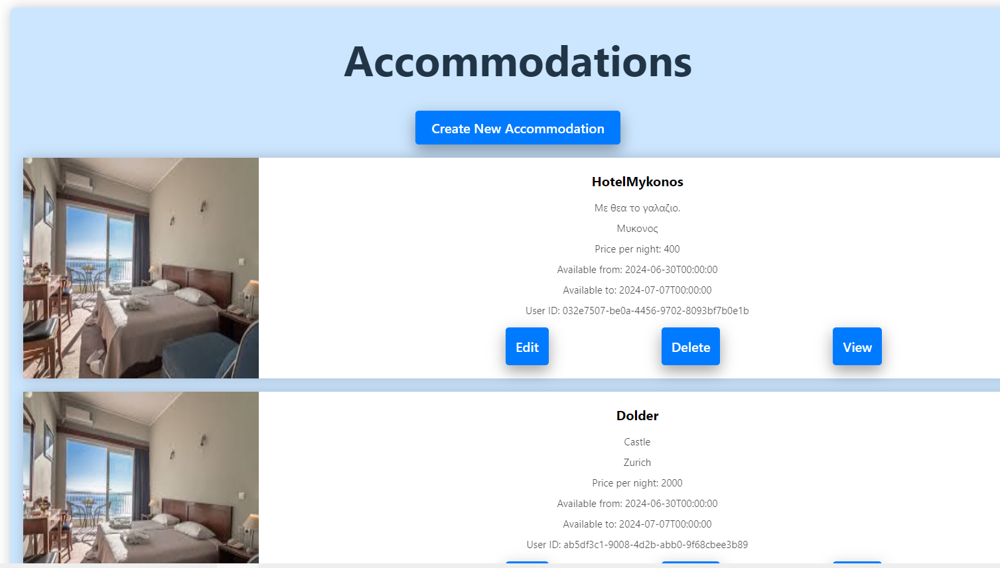
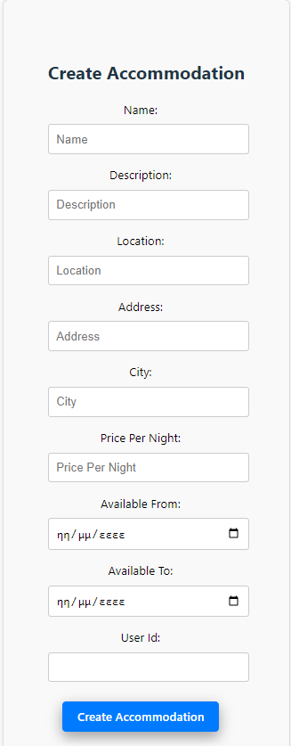
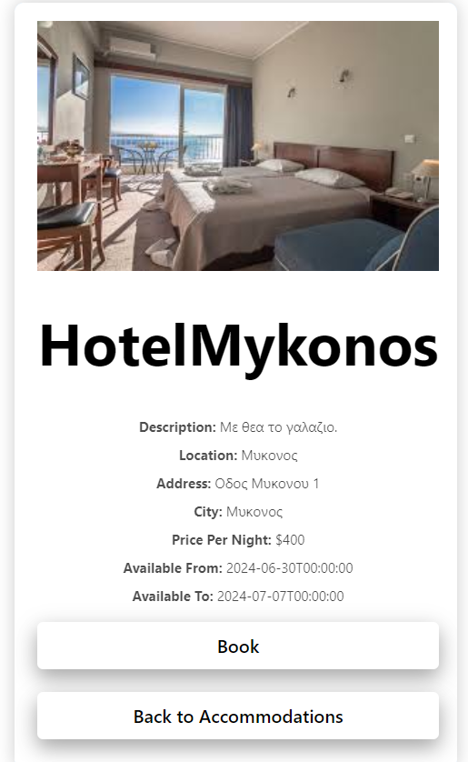
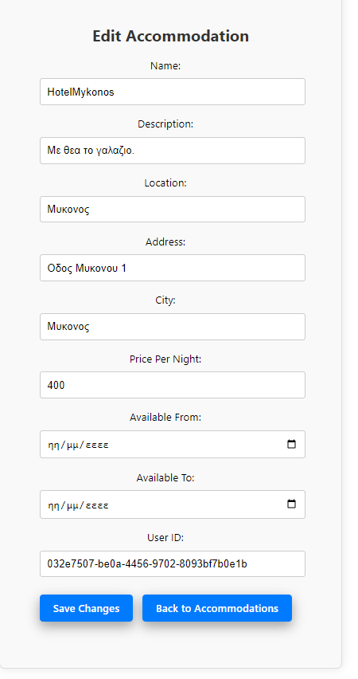

## **Hotel Booking App Frontend**

### __Introduction__
This repository contains the frontend part of the Hotel Booking App, a project developed as the final assignment for the Coding Factory course. The application allows users to search for hotels, view details, and make bookings. The frontend is built using React, providing a dynamic and responsive user experience.

### __Features__
User Authentication (Login/Signup)
Search and filter hotels
View hotel details
Book hotel rooms
Responsive design for various devices
Technologies Used
React
Redux (for state management)
Axios (for API calls)
React Router (for navigation)
CSS/SCSS (for styling)
Installation
To run the project locally, follow these steps:

#### 1. Clone the repository
git clone https://github.com/yourusername/hotel-booking-app-frontend.git
cd hotel-booking-app-frontend
Install dependencies

npm install
Set up environment variables
Create a .env file in the root directory and add the necessary environment variables. Refer to .env.example for the required variables.

Run the application

npm start
Open your browser
Navigate to http://localhost:3000 to view the application.

### __Project Structure__
hotel-booking-app/
├── node_modules/
├── public/
├── src/
│   ├── components/
│   ├── pages/
│   ├── services/
│   ├── styles/
│   └── App.js
├── .env
├── package.json
├── package-lock.json
└── README.md

#### __Screenshots__

### __Future Improvements__
Implement unit and integration tests
Add more filters for hotel search
Enhance UI/UX design
License
This project is licensed under the MIT License - see the LICENSE file for details.